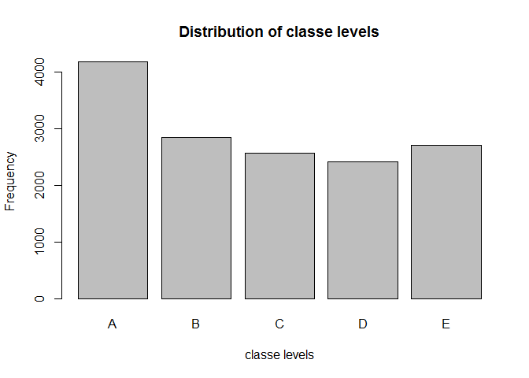

# Practical ML project
EMFS  
Sunday, May 24, 2015  

### Introduction ###
This analysis builds a machine learning model to predict how a human is performing a dumbell lift.
The predictive model uses data captured from accelerometers that measure bodily movements of subjects performing the dumbell lifts in different manners.  

### Data ###  
Six male subjects ranging in age between 20 - 28 years were fitted with accelerometers placed on the belt, forearm, arm.  An additional accelerometer placed on the dumbell.  Measurements from the accelerometers were captured during the exercise in sliding time windows ranging from 0.5 to 2.5 seconds.

The outcome variable is `classe`, a factor variable with 5 levels. For this data set, participants were asked to perform one set of 10 repetitions of the Unilateral Dumbbell Biceps Curl in 5 different ways:

- exactly according to the specification (Class A)
- throwing the elbows to the front (Class B)
- lifting the dumbbell only halfway (Class C)
- lowering the dumbbell only halfway (Class D)
- throwing the hips to the front (Class E)

The data source and the original study are from the paper *Qualitative Activity Recognition of Weight Lifting Exercieses*. (Velloso, E.; Bulling, A.; Gellersen, H.; Ugulino, W.; Fuks, H. Qualitative Activity Recognition of Weight Lifting Exercises. Proceedings of 4th International Conference in Cooperation with SIGCHI (Augmented Human '13) . Stuttgart, Germany: ACM SIGCHI, 2013.  Available at http://groupware.les.inf.puc-rio.br/work.jsf?p1=11201)

### Loading


```r
require(caret)
```

```
## Loading required package: caret
## Loading required package: lattice
## Loading required package: ggplot2
```

```r
require(randomForest)
```

```
## Loading required package: randomForest
## randomForest 4.6-10
## Type rfNews() to see new features/changes/bug fixes.
```

```r
# seed to be able to reproduce the exact results (Random Forrest is a nondeterministic algorithm)
set.seed(1234)

# loading
training <- read.csv('./data/pml-training.csv', na.strings=c("NA","#DIV/0!", ""))
testing <- read.csv('./data/pml-testing.csv' , na.strings=c("NA", "#DIV/0!", ""))
```

### Data cleaning

- omit variables with NA values;
- subset to keep only relevant variables;


```r
# Clean data
training<-training[,colSums(is.na(training)) == 0]
testing <-testing[,colSums(is.na(testing)) == 0]

# Subset data
training   <- training[,-c(1:7)]
testing  <- testing[,-c(1:7)]
```

### Cross-validation
Cross-validation will be performed by splitting the training data into training (75%) and testing (25%) data.


```r
subSamples <- createDataPartition(y=training$classe, p=0.75, list=FALSE)
subTraining <- training[subSamples, ] 
subTesting <- training[-subSamples, ]
```

### EDA
The variable `classe` contains 5 levels. The plot of the outcome variable shows the frequency of each level in the subTraining data.


```r
plot(subTraining$classe, main="Distribution of classe levels", xlab="classe levels", ylab="Frequency")
```

 

Level A is the most frequent and D the least frequent class, but these frequency differences shouldn't be enough to introduce a bias.

### Random Forest


```r
# Fit model
modFitRF <- randomForest(classe ~ ., data=subTraining, method="class")

# Perform prediction
predictRF <- predict(modFitRF, subTesting, type = "class")
```

The confusion matrix shows the high accuracy of the RF predictive model.


```r
confusionMatrix(predictRF, subTesting$classe)
```

```
## Confusion Matrix and Statistics
## 
##           Reference
## Prediction    A    B    C    D    E
##          A 1395    1    0    0    0
##          B    0  946   11    0    0
##          C    0    2  843    8    0
##          D    0    0    1  796    0
##          E    0    0    0    0  901
## 
## Overall Statistics
##                                         
##                Accuracy : 0.9953        
##                  95% CI : (0.993, 0.997)
##     No Information Rate : 0.2845        
##     P-Value [Acc > NIR] : < 2.2e-16     
##                                         
##                   Kappa : 0.9941        
##  Mcnemar's Test P-Value : NA            
## 
## Statistics by Class:
## 
##                      Class: A Class: B Class: C Class: D Class: E
## Sensitivity            1.0000   0.9968   0.9860   0.9900   1.0000
## Specificity            0.9997   0.9972   0.9975   0.9998   1.0000
## Pos Pred Value         0.9993   0.9885   0.9883   0.9987   1.0000
## Neg Pred Value         1.0000   0.9992   0.9970   0.9981   1.0000
## Prevalence             0.2845   0.1935   0.1743   0.1639   0.1837
## Detection Rate         0.2845   0.1929   0.1719   0.1623   0.1837
## Detection Prevalence   0.2847   0.1951   0.1739   0.1625   0.1837
## Balanced Accuracy      0.9999   0.9970   0.9917   0.9949   1.0000
```

### Conclusion

#### Result

The Random Forest model has an excellent accuracy (0.9953 (95% CI: (0.993, 0.997)). Thus validating the choices made while cleaning the data and discarding unnecessary variables.

#### Expected out-of-sample error
The expected out-of-sample error is estimated at 0.5%. The expected out-of-sample error is calculated as 1 - accuracy for predictions made against the cross-validation set. The test data set contains 20 cases, then, with an accuracy above 99% on our cross-validation data, we can expect that there should be no missclassification of the test samples.

### Submission
Having selected a RF algoritm using cross validation, ideally the model should be fitted again with the full set of training data and then be applied to the test data. But considering that the results are already excellent, there's no need to retrain for only 20 test cases.
The files for the project submission are generated using the random forest model on the testing data.


```r
# Perform prediction
predictSubmission <- predict(modFitRF, testing, type="class")
predictSubmission
```

```
##  1  2  3  4  5  6  7  8  9 10 11 12 13 14 15 16 17 18 19 20 
##  B  A  B  A  A  E  D  B  A  A  B  C  B  A  E  E  A  B  B  B 
## Levels: A B C D E
```

```r
# Write files for submission
pml_write_files = function(x){
  n = length(x)
  for(i in 1:n){
    filename = paste0("./data/submission/problem_id_",i,".txt")
    write.table(x[i],file=filename,quote=FALSE,row.names=FALSE,col.names=FALSE)
  }
}

pml_write_files(predictSubmission)
```
